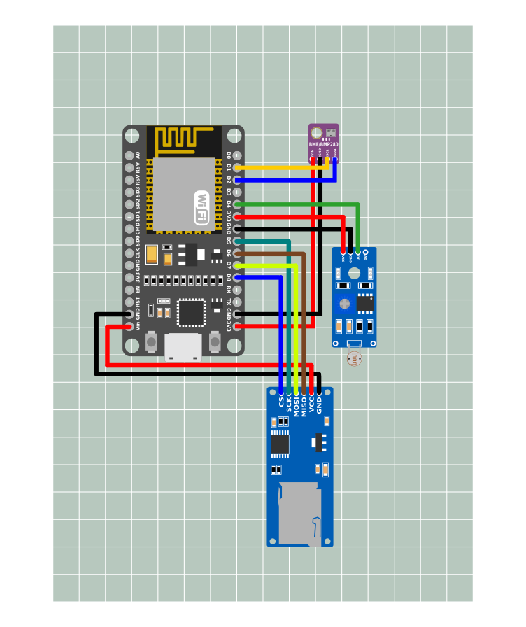

# **O Projeto**
A proposta da disciplina de Teoria Geral de Sistemas, foi elaborar um projeto de um produto que contemplasse o tema de sustentabilidade.  

### **Descrição do Projeto**
Criar uma estação meteorológica de baixo custo que tenha conexão com a internet e que forneça dados para pequenas propriedades de agricultura familiar.

### **Justificativa**
Auxiliar na prevenção de eventos meteorológicos na agricultura familiar analisando microclimas, visto que estações meteorológicas muitas vezes não estão instaladas nas capitais distantes de alguns municípios do interior

### **Benefícios**
Produto de baixo custo para leituras pontuais nas propriedades de temperatura, umidade, pressão e altitude.

### **Objetivos**
* Criar protótipo da estação meteorológica e do aplicativo até 2 semanas antes da data prevista de apresentação na disciplina de Teoria Geral de Sistemas;  

* Fornecer lista de componentes eletrônicos necessários para confecção e disponibilizar o código utilizado na programação do microcontrolador por meio da plataforma Github, conforme andamento do projeto.

## **Autores**
* Leandro Costa Garcia  
* Douglas Strappasson  
* Fábio Cançado  
* Gilberty Albues Soares  
* Leonardo Otake  
* Mathews Matos

# O Protótipo

O protótipo desenvolvido no período da disciplina contempla um nodemcu v1.0, um bme280, um módulo LDR(melhoria) e um módulo de cartão micro SD (melhoria).

## Lista de materiais:
Projeto sketch v1.0  
* Nodemcu - esp8266 12E - ([datashet](http://www.inf.puc-rio.br/~abranco/eng1450/NodeMCU-Micro/NodeMCU.pdf))
* Módulo BME280 - ([datashet](https://cdn-shop.adafruit.com/datasheets/BST-BMP280-DS001-11.pdf))
* Módulo Micro SD - ([datashet](http://datalogger.pbworks.com/w/file/fetch/89507207/Datalogger%20-%20SD%20Memory%20Reader%20Datasheet.pdf))
* Módulo LDR - LM393 - ([datashet](https://www.usinainfo.com.br/index.php?controller=attachment&id_attachment=78))

## Montagem

## Funcionamento
1. Após a montagem, certifique-se que todas as conexões estejam como na figura acima.  
2. **Insira um cartão micro SD**, formatado em FAT32 no módulo micro SD.  
3. Alimente o sistema o padrão do Nodemcu é **5V**.  
4. O controlador cria uma conexão **wi-fi** que pode ser acessada por outros equipamentos.  
5. Para acessá-la ative a wi-fi do equipamento para conexão, busque pela SID da rede criada pelo controlador.  
6. Entre com a senha de acesso e após a conexão reaizada, abra um browser no dispositivo e digite o IP padrão.

### **Rede de acesso:**  
**SID:** climacontrol  
**Senha:** UFMT2020  

### **IP Padrão**
**IP:** 192.168.4.1

Ao acessar o controlador pelo IP, será apresentada a leitura dos sensores, todos os dados das leitura serão persistido no cartão micro SD, podendo ser acessá-dos no computador por um leitor padrão de cartão.

